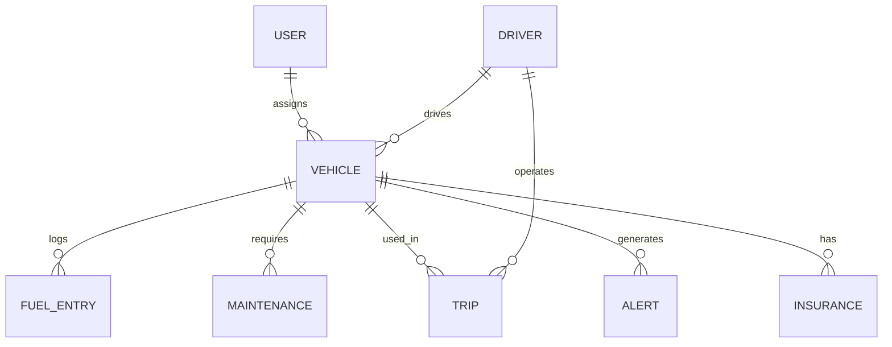

# Fleet Management Application Plan

## Requirements

The application will manage vehicle fleets, track fuel consumption, maintenance, send alerts, and optimize costs.

Key features:
- Vehicle management
- Driver assignment
- Fuel logging
- Maintenance scheduling
- Trip recording
- Alerts for maintenance due, fuel efficiency
- Cost reports
- Web app with React
- Mobile app with React Native

## Entities

- User: id, username, password, role (admin, manager, driver)
- Vehicle: id, make, model, year, license_plate, vin, status (active, maintenance), driver_id
- Driver: id, name, license_number, contact_info
- FuelEntry: id, vehicle_id, date, liters, cost_per_liter, total_cost, odometer, fuel_station
- Maintenance: id, vehicle_id, date, type, description, cost, next_service_date, next_service_mileage
- Trip: id, vehicle_id, driver_id, start_date, end_date, start_odometer, end_odometer, distance, purpose
- Alert: id, vehicle_id, type (maintenance, fuel, cost), message, created_date, resolved (boolean)
- Insurance: id, vehicle_id, policy_number, provider, start_date, end_date, premium

## Database Schema

Using SQLite3.

Tables:

```sql
CREATE TABLE users (
  id INTEGER PRIMARY KEY,
  username TEXT UNIQUE,
  password_hash TEXT,
  role TEXT
);

CREATE TABLE drivers (
  id INTEGER PRIMARY KEY,
  name TEXT,
  license_number TEXT UNIQUE,
  contact_info TEXT
);

CREATE TABLE vehicles (
  id INTEGER PRIMARY KEY,
  make TEXT,
  model TEXT,
  year INTEGER,
  license_plate TEXT UNIQUE,
  vin TEXT UNIQUE,
  status TEXT,
  driver_id INTEGER,
  FOREIGN KEY (driver_id) REFERENCES drivers(id)
);

CREATE TABLE fuel_entries (
  id INTEGER PRIMARY KEY,
  vehicle_id INTEGER,
  date TEXT,
  liters REAL,
  cost_per_liter REAL,
  total_cost REAL,
  odometer INTEGER,
  fuel_station TEXT,
  FOREIGN KEY (vehicle_id) REFERENCES vehicles(id)
);

CREATE TABLE maintenance (
  id INTEGER PRIMARY KEY,
  vehicle_id INTEGER,
  date TEXT,
  type TEXT,
  description TEXT,
  cost REAL,
  next_service_date TEXT,
  next_service_mileage INTEGER,
  FOREIGN KEY (vehicle_id) REFERENCES vehicles(id)
);

CREATE TABLE trips (
  id INTEGER PRIMARY KEY,
  vehicle_id INTEGER,
  driver_id INTEGER,
  start_date TEXT,
  end_date TEXT,
  start_odometer INTEGER,
  end_odometer INTEGER,
  distance REAL,
  purpose TEXT,
  FOREIGN KEY (vehicle_id) REFERENCES vehicles(id),
  FOREIGN KEY (driver_id) REFERENCES drivers(id)
);

CREATE TABLE alerts (
  id INTEGER PRIMARY KEY,
  vehicle_id INTEGER,
  type TEXT,
  message TEXT,
  created_date TEXT,
  resolved INTEGER DEFAULT 0,
  FOREIGN KEY (vehicle_id) REFERENCES vehicles(id)
);

CREATE TABLE insurance (
  id INTEGER PRIMARY KEY,
  vehicle_id INTEGER,
  policy_number TEXT,
  provider TEXT,
  start_date TEXT,
  end_date TEXT,
  premium REAL,
  FOREIGN KEY (vehicle_id) REFERENCES vehicles(id)
);
```

## ER Diagram



## Project Structure

- backend/
  - package.json
  - server.js
  - db/
    - schema.sql
    - connection.js
  - routes/
    - vehicles.js
    - drivers.js
    - fuel.js
    - maintenance.js
    - trips.js
    - alerts.js
    - insurance.js
    - users.js
- frontend/
  - package.json
  - src/
    - components/
    - App.js
- mobile/ (later)

## Implementation Plan

Follow the todo list for steps.